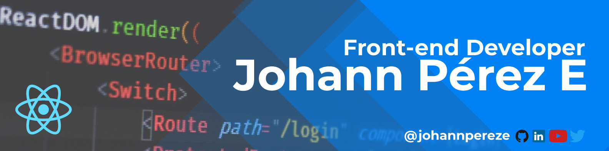

  

# ¡Greetings, Visitor! 👋

## I'm A Frontend Developer
Specialized in Javascript and modern frameworks/libraries. I love UI/UX design. I am interested in developing software solutions from planning to integration with Rest APIs, agilely delivering functional software with continuous deployments using the SCRUM methodology.

## My stack:

- React / Angular
- JavaScript / TypeScript
- Jest / Testing Library
- MUI / PrimeNg
- Figma / Illustrator
- NodeJs / Express

## My coolest projects: (click even if you're not a developer)

 - [Masters Memory Game](https://masters-memory.netlify.app/)
 - [Arduino Spanish Course](https://www.youtube.com/playlist?list=PLyLh25DppBIe40j3VBAslnVfs4Pz-B3ZB) 
 - [Pokedex](https://johannpereze.github.io/pokedex/)
 - [GifsApp](https://gifappbyjohannpereze.netlify.app/) 
 - [CountriesApp](https://countrys-by-johannpereze.netlify.app/)
 - [AngularPipes](https://angular-pipes-johannpereze.netlify.app/)

## Additional Info

<!---
johannpereze/johannpereze is a ✨ special ✨ repository because its `README.md` (this file) appears on your GitHub profile.
You can click the Preview link to take a look at your changes.
--->
